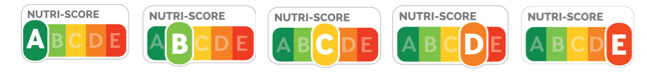
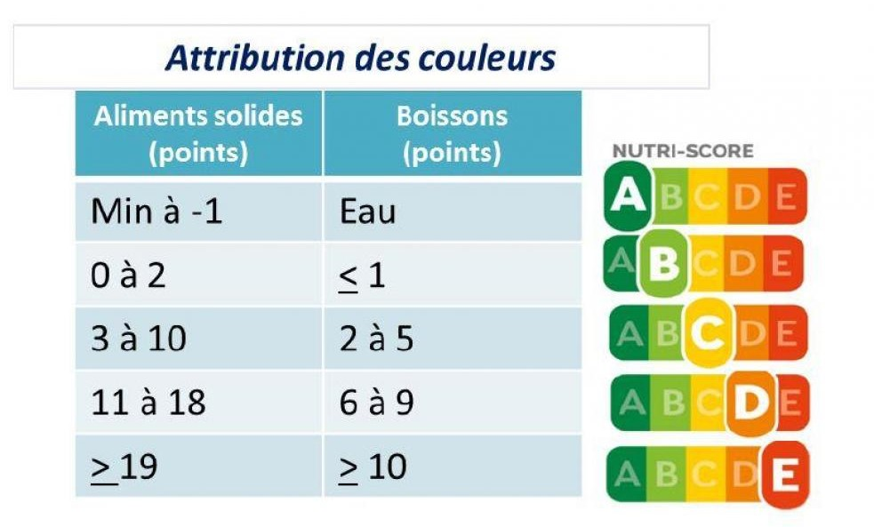

# I. Présentation
## 1) Enjeux alimentaires et présentation du Nutri-Score
### a. Pourquoi devrait-on penser à notre alimentation ?
 La question de l’alimentation représente un sujet majeur de santé publique. L'alimentation constitue l'une des trois principales causes de morbidité, de mortalité prématurée et de handicap en Europe, selon l’étude Global Burden of Disease (GBD, 2016). De ce fait, la nutrition est un facteur de risque pour plusieurs troubles et maladies chroniques, dont l’obésité, le diabète, les maladies cardiovasculaires, ou certains types de cancers (Ebbeling, 2002 ; Lobstein, 2004). Ce constat est d’autant plus alarmant si l’on considère le fait que 47,3 % de la population française est en surpoids, et 17,0 % est obèse, selon une étude menée à l'initiative de la "Ligue Contre l'Obésité (Fontbonne, 2020). Les causes de cette prévalence de surpoids sont multiples et résultent d’un déséquilibre entre apport et dépense d’énergie. Dans ce contexte, l'étiquetage nutritionnel a émergé de manière progressive en tant que politique alimentaire et préventive majeure, pour faire face à ces nouveaux défis. Ce dernier vise une conscientisation des populations, leur permettant de prendre des décisions de consommation éclairées et plus équilibrées au quotidien. 

### b. Présentation du Nutri-Score :
 Adopté en France, en application de la loi de « Modernisation de Notre Système de Santé » du 26 janvier 2016, le Nutri-Score est un système d'étiquetage nutritionnel simplifié et facultatif.

La signalétique du Nutri-Score attribue un score de A (“meilleure qualité nutritionnelle”) à E (“moins bonne qualité nutritionnelle”) aux produits alimentaires. Chaque lettre est accompagnée d'une couleur spécifique, allant du vert au rouge, pour évaluer la qualité nutritionnelle des aliments, en se basant sur une portion de 100 g (Ministère de la Santé et de la Prévention, 2023). Le calcul du score se fonde sur les données fournies par la déclaration nutritionnelle obligatoire associée à chaque produit alimentaire. Le Nutri-Score les classe alors en deux catégories de nutriments : ceux à favoriser, en l’occurrence les fruits, légumes, fibres, protéines, etc., et ceux à limiter, tels que le sucre, acides gras saturés, sel, etc. Le Nutri-Score n’a pas seulement vocation à permettre au consommateur de mieux connaître le profil nutritionnel global des denrées alimentaires. Il constitue une véritable norme qui oriente le choix des consommateurs vers la décision la plus favorable à leur santé, dans un contexte de surcharge informationnelle (Friant-Perrot, 2021).

## 2) Construction du Nutri-Score : comment est fait le calcul? 
 Comment est-il précisément calculé, le Nutri-Score ? Comme évoqué précédemment, la classification de la qualité nutritionnelle du produit varie de A à E, avec des couleurs allant du vert foncé au rouge, attribuées en fonction des points obtenus pour 100g. Le calcul se déroule en trois étapes distinctes.

Dans la première étape, des points dits "négatifs" (N), représentant des nutriments dont la consommation est nuisible pour la santé, sont attribués en fonction de la quantité présente dans le produit. Chaque catégorie, comprenant les graisses saturées (g), les sucres simples (g), le sodium/sel (mg) et l'énergie (kJ), est évaluée de 0 à 10 points. Ainsi, le nombre maximal de points négatifs est de 40. Pour la deuxième étape, des points "positifs" (P), favorables à la santé, sont attribués de 0 à 5 pour chacun des éléments suivants : fibres, protéines, teneur en fruits, légumes, certaines huiles et noix (%). Le chiffre maximal possible à atteindre est de 15.

Enfin, lors de la dernière étape, pour obtenir la valeur finale du Nutri-Score, il suffit de soustraire le nombre de points positifs obtenus dans la deuxième étape du nombre de points négatifs de la première étape. Sur une échelle allant de -15 à 40, plus le résultat est bas, meilleure est la qualité nutritionnelle. Une fois le calcul effectué, on associe la valeur nutritionnelle résultante à une lettre en fonction des seuils de classement suivants:
 

## 3) Le Nutri-Score : un outil dont la légitimité est débattue
### a. La perception divergente du Nutri-Score par l’industrie agro-alimentaire
 En termes de déploiement du Nutri-Score, l’industrie agro-alimentaire adopte deux positions opposées. Alors que plusieurs industriels soutiennent et participent activement au déploiement du Nutri-Score, certains lobbys agroalimentaires adoptent une posture de détracteurs. Cette divergence s’inscrit dans des considérations économiques, concurrentielles et stratégiques, ainsi que par la manière dont les entreprises évaluent l'impact de cet outil sur leur image de marque et leurs ventes (Sommier et al., 2021).

D’une part, le Nutri-Score a réussi à s'imposer dans l'industrie agroalimentaire. Alors qu'en 2018, seuls 70 exploitants le soutenaient, leur nombre est passé à 500 en 2020 (Halley Des Fontaines, 2023), et ce chiffre atteint les 989 exploitants engagés en juin 2022 (Narayanane, 2023). Le Nutri-Score couvre désormais une large gamme de produits alimentaires, avec 7 300 produits étiquetés en 2023 (Halley Des Fontaines, 2022). Similairement, le pourcentage du volume des ventes couvert par le Nutri-Score est passé de 23% en 2018 à 58% en 2022 (Narayanane, 2023). 
D’autre part, parmi les détracteurs du Nutri-Score se trouvent certaines multinationales telles que Mars, Coca-Cola, Mondelez, Unilever, PepsiCo et Nestlé, qui ont refusé d'adopter le Nutri-Score. Ces acteurs ont décidé de développer leurs propres systèmes de notation nutritionnelle pour rivaliser avec le Nutri-Score. On retrouve par exemple le système d'Evolved Nutrition Label (ENL), qui se base sur le calcul de la valeur nutritionnelle non pas pour 100 g, mais par portion (Dereuder, 2018). Ainsi l’étiquetage ENL apparaît plus favorable pour certains produits moins bons pour la santé (gras, sucré et/ou salé) en se traduisant par des pastilles de couleur orange, et non en rouge comme sur le Nutri-Score. Un des arguments avancés par les industriels promouvant l’ENL est que l’attribution des couleurs selon la portion permettrait aux consommateurs de mieux prendre en compte les apports relatifs à leur consommation réelle du produit, et donc d’avoir un meilleur impact sur leurs habitudes alimentaires (Pigeyre et al., 2018).

### b. Malgré cette légitimité parfois débattue, le Nutri-Score connaît une forte popularité auprès des consommateurs
Le niveau de sensibilisation du public à l'égard du Nutri-Score est significatif. En effet, selon une étude de Santé Publique France de 2021, il a été rapporté que 95 % des adultes interrogés déclaraient avoir déjà été exposés et/ou familiers avec le Nutri-Score (Sarda et al., 2021). Le Nutri-Score s'insère de manière significative dans la vie quotidienne des Français. Selon une étude de Santé Publique France en 2021, il a été estimé que 77 % des Français avaient déjà acheté un produit portant le logo du Nutri-Score en juillet 2021 (ibid.). Il est également important de noter que la notoriété du Nutri-Score varie en fonction de l'âge du public cible, les adolescents étant plus informés que la population adulte, avec une connaissance de 97 % contre 95 % pour les adultes (ibid.).
 
De plus, le rapport 2020 de Santé publique France met en avant le degré élevé de de compréhension effective du logo nutritionnel. En effet 90 % des Français présentent le Nutri-Score comme permettant d'évaluer la qualité nutritionnelle des produits alimentaires, avec une augmentation de 4 points par rapport à mai 2019 (Santé Publique France, 2020). Similairement, 66 % des personnes interrogées associaient spontanément le Nutri-Score à sa fonction d'information sur la "composition et qualité nutritionnelle du produit" (ibid.). Le format du Nutri-Score est également présenté comme facilement identifiable et compréhensible (Chantal et al., 2018).
Au vu des enjeux liés au Nutri-Score abordés jusqu'ici, il semblerait que plusieurs questionnements persistent. **Le déploiement du Nutri-Score est interrogé au regard de sa capacité à modifier réellement les comportements et choix de consommation et représente l’objet de notre étude présentée ci-dessous.** 

Kaoutar Laklalech - Sofya Davidovich - Raja Madani - Pauline Chatail - Célia Outemzabet - Yeon Hwa Kim
