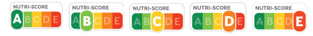

--- 
title: 'Nutri-score: un outil pour mieux manger ?'
layout: page
--- 

# SYNTHESE DES RESULTATS
Cette étude a révélé que le Nutri-Score semble bénéficier d’une perception positive auprès d’une large part des jeunes interrogés. En effet, à travers son design simple et intuitif, celui-ci leur permet de s’informer davantage sur les apports nutritionnels des produits qu’ils consomment et de se sensibiliser à leurs impacts sur la santé.

Le Nutri-Score est un outil que les jeunes ont tendance à utiliser et à prendre en considération lors de leurs achats. Il tend, dans une certaine mesure, à influencer et/ou déterminer les choix et arbitrages dans les habitudes de consommation. 

En revanche, cette étude a démontré certaines limites du Nutri-Score quant à sa perception et son utilisation auprès des jeunes. En effet, l’outil fait l’objet d’un scepticisme conséquent notamment quant à la manière dont les scores sont obtenus, témoignant ainsi d’un fort besoin de transparence et de clarté à ce sujet. L’absence d’obligation légale pour les producteurs d’instaurer le Nutri-Score sur chacun de leur produit limite également grandement la pertinence de l’indice. Enfin, le mode de calcul de l’indice lui-même est soumis à des questionnements étant donné qu’il ne prend pas en compte un certain nombre d’éléments, tels que le niveau de transformation des aliments, la teneur en pesticides, ou encore l’impact environnemental. 

Il convient alors de se demander si le Nutri-Score ne devrait pas intégrer ces différents éléments de sorte à s’ouvrir à d’autres domaines et à gagner en précision. Cela devrait faire l’objet d’une réflexion plus approfondie de la part de nos décideurs publics. Les limites concernant le Nutri-Score impliquent également une nécessité de plus grande prise en considération des enjeux nutritionnels de la part des consommateurs, producteurs et décideurs publics. Cela doit principalement passer par l’éducation et la sensibilisation à ces enjeux ainsi que par une pression plus grande envers les producteurs.

In fine, le design du Nutri-Score semble séduire au-delà même du domaine de la nutrition. En effet, l’enseigne King Jouet ou encore le laboratoire Pierre Fabre se sont dernièrement approprié le modèle afin de rendre compte de l'éco responsabilité des produits distribués. Cela semble illustrer l’utilité réelle du Nutri-Score : celle d’informer dans le but de responsabiliser. 

Kaoutar Laklalech - Sofya Davidovich - Raja Madani - Pauline Chatail - Célia Outemzabet - Yeon Hwa Kim
