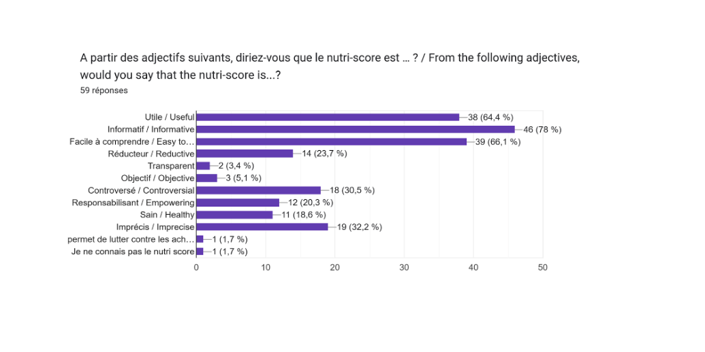
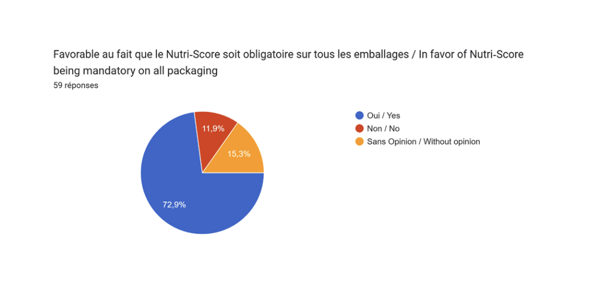

# II. NOTRE ETUDE
## 1) Description
### a. Objectifs

Nous avons souhaité mener une étude pour évaluer les perceptions et l’impact du Nutri-Score sur les habitudes alimentaires des jeunes. Nous avons décidé de focaliser notre étude sur le public jeune en raison de son statut de cible privilégiée des politiques nutritionnelles en matière de santé publique, telles que définies dans le Programme National Nutrition Santé 2019-2023.

Les objectifs de notre étude sont les suivant : 

(1) Identifier le degré de compréhension de l’outil (connaissance de l’objectif, du fonctionnement et interprétation des échelons du Nutri-Score)

(2) Évaluer le niveau de popularité du Nutri-Score chez les jeunes, identifier les éléments qui suscitent la résistance ou l'opposition

(3) Identifier l’impact du Nutri-Score pour orienter à court terme les arbitrages de choix de consommation des jeunes 

(4) dentifier l’impact du Nutri-Score pour modifier sur le long terme les habitudes alimentaires 

(5) Appréhender les positions des jeunes sur les éventuelles évolutions de la politique (en terme de généralisation et de rendre obligatoire)

### b. Méthodologie 

Notre étude combine une approche à la fois quantitative et qualitative. Pour la partie quantitative, nous avons utilisé un questionnaire pour recueillir des données sur les habitudes alimentaires, les perceptions et les opinions des jeunes consommateurs. Ce questionnaire a été distribué à différents groupes d'étudiants en ligne, couvrant une tranche d'âge de 15 à 30 ans. Nous avons collecté des informations sur leur profil (âge, sexe, situation socio-professionnelle de leurs parents, situation géographique, situation professionnelle/académique, domaine d'études, habitudes alimentaires), ainsi que sur leurs attitudes envers le Nutri-Score, dans l’optique de permettre de mettre en évidence des tendances, des nuances, des divergences et des convergences au sein de cette population de jeunes consommateurs. Nous avons interrogé 59 personnes via le questionnaire. 

En parallèle, la partie qualitative de notre étude s'est articulée autour d’un entretien en présentiel, d’une durée de 30 minutes, avec une consommatrice âgée de **X**, ainsi que d'un entretien écrit avec un chercheur en politiques de Santé à l’OCDE.

## 2) Résultats
### a. Perception du Nutri-Score auprès des jeunes

#### Alimentation et jeunes consommateurs : quelle équation ?

Le Nutri-Score, ce système d’étiquetage nutritionnel, a suscité un intérêt croissant parmi les jeunes consommateurs, particulièrement sensibles aux enjeux de santé et à la quête d'une alimentation équilibrée. L’étude a en effet montré que 98% des sondés font attention à leur alimentation, de façon plus ou moins assidue. De la même manière, 83% des sondés disent lire la composition nutritionnelle des produits achetés. Mais qu’en est-il du Nutri-Score ? Est-ce un indicateur prisé par les jeunes consommateurs ? 

#### La compréhension du Nutri-Score

L’étude a montré qu’effectivement, les jeunes sont sensibles au Nutri-Score puisque 93% des sondés affirment en avoir déjà entendu parler. “Indicateur”, “échelle nutritionnelle”, “étiquette”, “système de notation” : peu importe l'appellation, les sondés ont compris l’essence du Nutri-Score. Pour les jeunes, le Nutri-Score offre une solution visuelle et accessible à tous, pour prendre des décisions informées lors de leurs achats alimentaires. Cet “indicateur facultatif” correspond, selon les sondés, à un “outil de mesure pour vérifier la qualité et la valeur nutritionnelle d’un produit”, avec une notation allant de A à F. Plus généralement, le Nutri-Score se présente comme un “indicateur visuel et facile à comprendre”, qui permet de “savoir si un produit est bon ou mauvais pour la santé”, en fonction de sa composition. Cette facilité de compréhension offerte par l’outil du Nutri-Score nous a également été exprimée par la consommatrice interrogée : “c’est assez difficile de s'informer, d’apprendre à lire soi-même les ingrédients et les apports nutritionnels comme ça donc avec le Nutri-Score, ça aide vraiment beaucoup à rendre l’information accessible et intuitive” nous a-t-elle confié. 

Certains jeunes voient le Nutri-Score comme un outil pratique pour adopter des habitudes alimentaires plus saines. Il est en effet perçu unanimement comme une aide à la décision, puisqu’il permet “d’informer, voire d’alerter le consommateur sur la composition et la qualité nutritionnelle des produits”. Cette aide à l’orientation des consommateurs par le Nutri-Score est particulièrement vraie pour les produits de nécessité. Comme nous l’indique notre consommatrice interrogée, “si c’est pour quelque chose que j’achète beaucoup, ça va être important pour moi de trouver dans la gamme du magasin le produit le mieux noté [...] pour les nécessités, je regarde et j’y fais attention”. 

Plus encore, les sondés révèlent une volonté de “sensibiliser et inciter à une meilleure alimentation pour une meilleure santé”, et donc “réduire l’obésité et lutter contre certaines maladies”. En d’autres termes, le Nutri-Score est un indicateur permettant un achat réfléchi et sain pour la santé, avec une volonté de “transparence dans la composition des produits”. 

#### Un scepticisme croissant

L’étude a en effet révélé une défiance grandissante auprès des jeunes consommateurs. Ainsi, 91.5% des sondés disent avoir déjà acheté un produit sur lequel figurait le Nutri-Score ; la présence de ce logo sur l’emballage ayant motivé l’achat à 69.5%. Néanmoins, l’opinion est davantage divisée dès lors que l’on parle de confiance. Seulement près de 41% disent avoir confiance en cet indicateur nutritionnel. 39% des sondés se disent neutre, et 20% disent manquer de confiance à l’égard du Nutri-Score.

Les principales raisons soulevées sont les suivantes :

➢ Manque de transparence et de précision concernant la méthode de calcul: comment sont évalués les produits ? Sur quels critères ? Sont-ils réellement pertinents ?

➢ Outil de promotion pour les marques : le Nutri-Score ne ferait-il pas de publicité mensongère ?

➢ Des prix plus élevés sur les produits au Nutri-Score élevé : le produit vaut-il vraiment le coût ?

➢ Certains produits affichent leur Nutri-Score et d’autres non : n’est-ce pas juste un moyen de vendre ?

Ce manque de confiance et ces doutes vis-à-vis du Nutri-Score sont partagés par la consommatrice interrogée, qui nous affirme avoir “souvent des doutes par rapport [...] à comment c'est calculé”. Celle-ci nous a fait part de sa surprise à la lecture de certains scores : “Il y a des produits où je me dis c’est sûr c’est plein de trucs mauvais pour soi et, lorsque je regarde, la note est de B et je me dis « c’est douteux ». Ou inversement”. Cependant, celle-ci explique tout de même que son niveau de confiance envers un Nutri-Score dépend du score en lui-même : “J’ai tendance à plus lui faire confiance quand c’est une mauvaise note parce que je me dis « bon au cas où ». Mais quand il lui donne une bonne note alors que j’ai l'impression que ce n’est pas bon, je commence à douter du système.” Cela rejoint le réel besoin de transparence et de précision concernant la méthode de calcul du Nutri-Score exprimé par les sondés.

#### Le Nutri-Score possède malgré tout une très bonne notoriété

En effet, 78% des sondés pensent que cet indicateur est informatif. Le Nutri-Score apparaît facile à comprendre et utile, avec respectivement 66% et 64%. L’étude révèle également un certain scepticisme à l’égard du Nutri-Score, puisque 30% des jeunes pensent qu’il s’agit d’un indicateur controversé, mais aussi, imprécis (32%) et réducteur (24%). 

Enfin, 84% des sondés sont favorables à l’apposition du Nutri-Score sur les emballages, sans pour autant nécessairement le rendre obligatoire.

Les études quantitatives et qualitatives ont finalement montré que les jeunes consommateurs ont une bonne compréhension des enjeux et des objectifs liés au Nutri-Score. Cet outil a été présenté comme un indicateur servant à évaluer la pertinence nutritionnelle d’un aliment, avec une lettre de A à F et une certaine colorimétrie. Ces deux études ont également mis en évidence les craintes naissantes concernant l’indicateur, qui ne prendrait pas en compte “le niveau de transformation des aliments dont sont issus les nutriments, ni les éventuels additifs nocifs”. Ce scepticisme est également lié à la fiabilité de l’indicateur qui, pour certains, pourrait n’être qu’un outil promotionnel pour les marques et les enseignes. Malgré tout, le Nutri-Score reste un outil jugé indispensable, grâce à sa simplicité et son apport pour la santé.

### b. L’impact sur les habitudes alimentaires

#### Faire des choix alimentaires plus éclairés

Le Nutri-Score vise à améliorer la clarté des informations nutritionnelles des produits et à encourager les consommateurs à opter pour des produits mieux notés sur le plan nutritionnel, par rapport à leurs alternatives moins bien notées, facilitant ainsi la prise de décision dans leurs choix de consommation. Le Nutri-Score fonctionne selon le principe du "nudging" (DELHOMME et al., 2020), car il vise à influencer les choix alimentaires des consommateurs au travers d’une colorimétrie stratégique, le vert étant associé à “l'approbation" et le rouge à "l'interdiction". 

Dans le cadre de notre étude, les résultats soulignent l'effet incitatif des scores Nutri-Score pour orienter les consommateurs vers des choix nutritionnellement plus sains. En effet, 73% des personnes interrogées ont affirmé que le Nutri-Score les encourage à opter pour des produits présentant les meilleurs scores nutritionnels. Il en est de même pour la consommatrice interrogée qui a insisté sur l’importance du Nutri-Score dans le choix de ses produits : “pour quelque chose que j’achète beaucoup, ça va être important pour moi de trouver dans la gamme du magasin le produit le mieux noté”. Notons cependant qu’une frange relativement importante des jeunes interrogés (19%) rapportent que la présence du Nutri-Score ne les incite pas à choisir les produits les mieux notés sur le plan nutritionnel. 

On constate des disparités liées au lieu de résidence, puisque, pour les individus résidant en région parisienne et dans de grandes villes, respectivement 76% et 72% déclarent que le Nutri-Score les a déjà incités à orienter leurs choix de consommation vers des produits affichant un meilleur notation Nutri-Score au sein d'une même catégorie de produits. En revanche, en milieu rural ou dans de petites villes, ce pourcentage n'est que de 33% (un écart qui mériterait une analyse approfondie dans des études futures). 

De même, notre enquête met en lumière un pic d'utilisation du Nutri-Score chez les 22-25 ans pour effectuer des choix alimentaires plus sains, avec 83% d'entre eux déclarant que le Nutri-Score les a déjà encouragés à privilégier des produits affichant un meilleur score nutritionnel au sein d'une même catégorie.
