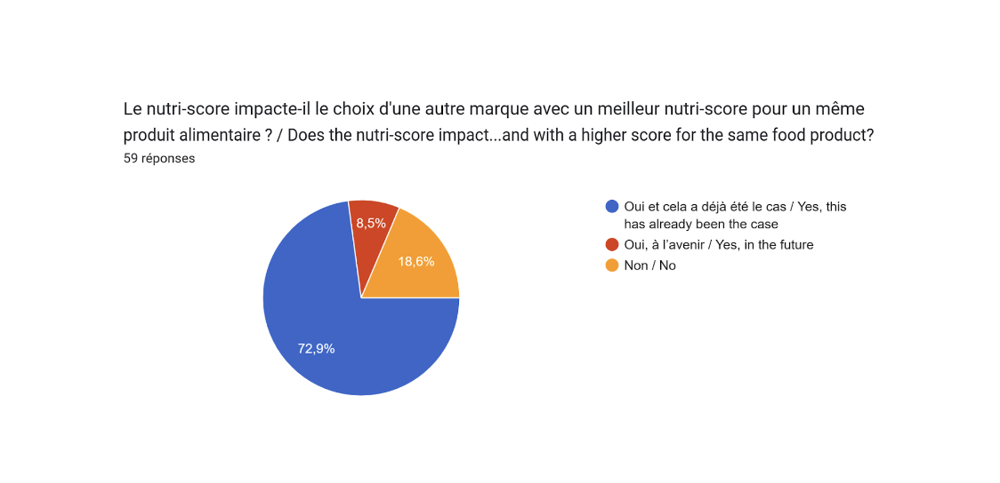
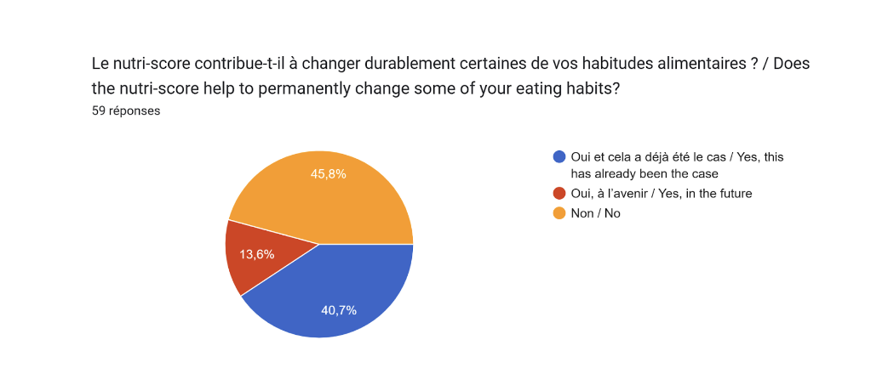
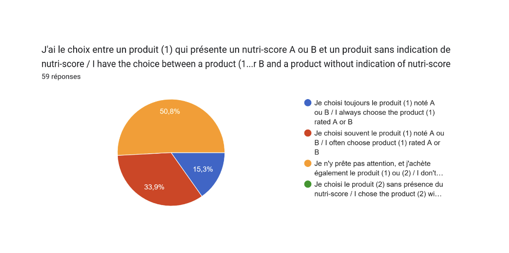
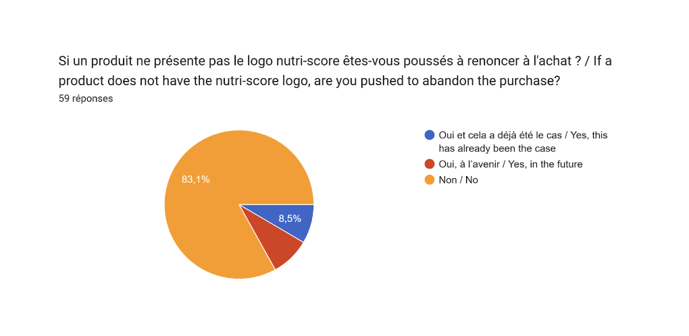
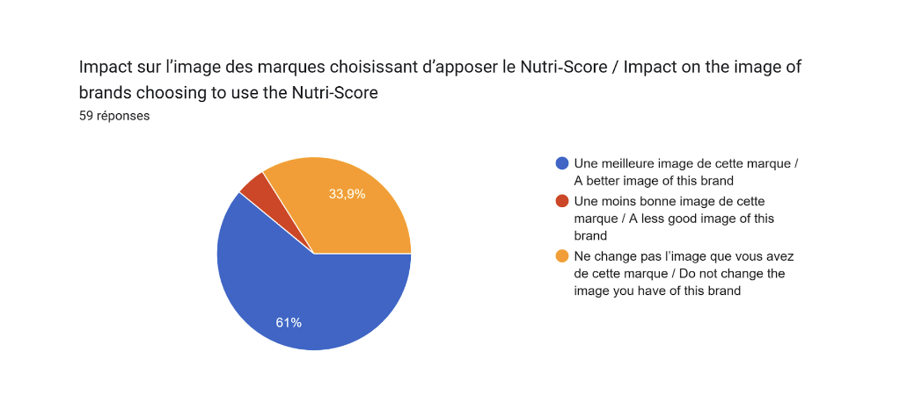

# II. NOTRE ETUDE
## 1) Description
### a. Objectifs

Nous avons souhaité mener une étude pour évaluer les perceptions et l’impact du Nutri-Score sur les habitudes alimentaires des jeunes. Nous avons décidé de focaliser notre étude sur le public jeune en raison de son statut de cible privilégiée des politiques nutritionnelles en matière de santé publique, telles que définies dans le Programme National Nutrition Santé 2019-2023.

Les objectifs de notre étude sont les suivant : 

(1) Identifier le degré de compréhension de l’outil (connaissance de l’objectif, du fonctionnement et interprétation des échelons du Nutri-Score)

(2) Évaluer le niveau de popularité du Nutri-Score chez les jeunes, identifier les éléments qui suscitent la résistance ou l'opposition

(3) Identifier l’impact du Nutri-Score pour orienter à court terme les arbitrages de choix de consommation des jeunes 

(4) dentifier l’impact du Nutri-Score pour modifier sur le long terme les habitudes alimentaires 

(5) Appréhender les positions des jeunes sur les éventuelles évolutions de la politique (en terme de généralisation et de rendre obligatoire)

### b. Méthodologie 

Notre étude combine une approche à la fois quantitative et qualitative. Pour la partie quantitative, nous avons utilisé un questionnaire pour recueillir des données sur les habitudes alimentaires, les perceptions et les opinions des jeunes consommateurs. Ce questionnaire a été distribué à différents groupes d'étudiants en ligne, couvrant une tranche d'âge de 15 à 30 ans. Nous avons collecté des informations sur leur profil (âge, sexe, situation socio-professionnelle de leurs parents, situation géographique, situation professionnelle/académique, domaine d'études, habitudes alimentaires), ainsi que sur leurs attitudes envers le Nutri-Score, dans l’optique de permettre de mettre en évidence des tendances, des nuances, des divergences et des convergences au sein de cette population de jeunes consommateurs. Nous avons interrogé 59 personnes via le questionnaire. 

En parallèle, la partie qualitative de notre étude s'est articulée autour d’un entretien en présentiel, d’une durée de 30 minutes, avec une consommatrice âgée de **X**, ainsi que d'un entretien écrit avec un chercheur en politiques de Santé à l’OCDE.

## 2) Résultats
### a. Perception du Nutri-Score auprès des jeunes

#### Alimentation et jeunes consommateurs : quelle équation ?

Le Nutri-Score, ce système d’étiquetage nutritionnel, a suscité un intérêt croissant parmi les jeunes consommateurs, particulièrement sensibles aux enjeux de santé et à la quête d'une alimentation équilibrée. L’étude a en effet montré que 98% des sondés font attention à leur alimentation, de façon plus ou moins assidue. De la même manière, 83% des sondés disent lire la composition nutritionnelle des produits achetés. Mais qu’en est-il du Nutri-Score ? Est-ce un indicateur prisé par les jeunes consommateurs ? 

#### La compréhension du Nutri-Score

L’étude a montré qu’effectivement, les jeunes sont sensibles au Nutri-Score puisque 93% des sondés affirment en avoir déjà entendu parler. “Indicateur”, “échelle nutritionnelle”, “étiquette”, “système de notation” : peu importe l'appellation, les sondés ont compris l’essence du Nutri-Score. Pour les jeunes, le Nutri-Score offre une solution visuelle et accessible à tous, pour prendre des décisions informées lors de leurs achats alimentaires. Cet “indicateur facultatif” correspond, selon les sondés, à un “outil de mesure pour vérifier la qualité et la valeur nutritionnelle d’un produit”, avec une notation allant de A à F. Plus généralement, le Nutri-Score se présente comme un “indicateur visuel et facile à comprendre”, qui permet de “savoir si un produit est bon ou mauvais pour la santé”, en fonction de sa composition. Cette facilité de compréhension offerte par l’outil du Nutri-Score nous a également été exprimée par la consommatrice interrogée : “c’est assez difficile de s'informer, d’apprendre à lire soi-même les ingrédients et les apports nutritionnels comme ça donc avec le Nutri-Score, ça aide vraiment beaucoup à rendre l’information accessible et intuitive” nous a-t-elle confié. 

Certains jeunes voient le Nutri-Score comme un outil pratique pour adopter des habitudes alimentaires plus saines. Il est en effet perçu unanimement comme une aide à la décision, puisqu’il permet “d’informer, voire d’alerter le consommateur sur la composition et la qualité nutritionnelle des produits”. Cette aide à l’orientation des consommateurs par le Nutri-Score est particulièrement vraie pour les produits de nécessité. Comme nous l’indique notre consommatrice interrogée, “si c’est pour quelque chose que j’achète beaucoup, ça va être important pour moi de trouver dans la gamme du magasin le produit le mieux noté [...] pour les nécessités, je regarde et j’y fais attention”. 

Plus encore, les sondés révèlent une volonté de “sensibiliser et inciter à une meilleure alimentation pour une meilleure santé”, et donc “réduire l’obésité et lutter contre certaines maladies”. En d’autres termes, le Nutri-Score est un indicateur permettant un achat réfléchi et sain pour la santé, avec une volonté de “transparence dans la composition des produits”. 

#### Un scepticisme croissant

L’étude a en effet révélé une défiance grandissante auprès des jeunes consommateurs. Ainsi, 91.5% des sondés disent avoir déjà acheté un produit sur lequel figurait le Nutri-Score ; la présence de ce logo sur l’emballage ayant motivé l’achat à 69.5%. Néanmoins, l’opinion est davantage divisée dès lors que l’on parle de confiance. Seulement près de 41% disent avoir confiance en cet indicateur nutritionnel. 39% des sondés se disent neutre, et 20% disent manquer de confiance à l’égard du Nutri-Score.

Les principales raisons soulevées sont les suivantes :

➢ Manque de transparence et de précision concernant la méthode de calcul: comment sont évalués les produits ? Sur quels critères ? Sont-ils réellement pertinents ?

➢ Outil de promotion pour les marques : le Nutri-Score ne ferait-il pas de publicité mensongère ?

➢ Des prix plus élevés sur les produits au Nutri-Score élevé : le produit vaut-il vraiment le coût ?

➢ Certains produits affichent leur Nutri-Score et d’autres non : n’est-ce pas juste un moyen de vendre ?

Ce manque de confiance et ces doutes vis-à-vis du Nutri-Score sont partagés par la consommatrice interrogée, qui nous affirme avoir “souvent des doutes par rapport [...] à comment c'est calculé”. Celle-ci nous a fait part de sa surprise à la lecture de certains scores : “Il y a des produits où je me dis c’est sûr c’est plein de trucs mauvais pour soi et, lorsque je regarde, la note est de B et je me dis « c’est douteux ». Ou inversement”. Cependant, celle-ci explique tout de même que son niveau de confiance envers un Nutri-Score dépend du score en lui-même : “J’ai tendance à plus lui faire confiance quand c’est une mauvaise note parce que je me dis « bon au cas où ». Mais quand il lui donne une bonne note alors que j’ai l'impression que ce n’est pas bon, je commence à douter du système.” Cela rejoint le réel besoin de transparence et de précision concernant la méthode de calcul du Nutri-Score exprimé par les sondés.

#### Le Nutri-Score possède malgré tout une très bonne notoriété

En effet, 78% des sondés pensent que cet indicateur est informatif. Le Nutri-Score apparaît facile à comprendre et utile, avec respectivement 66% et 64%. L’étude révèle également un certain scepticisme à l’égard du Nutri-Score, puisque 30% des jeunes pensent qu’il s’agit d’un indicateur controversé, mais aussi, imprécis (32%) et réducteur (24%). 

Enfin, 84% des sondés sont favorables à l’apposition du Nutri-Score sur les emballages, sans pour autant nécessairement le rendre obligatoire.

Les études quantitatives et qualitatives ont finalement montré que les jeunes consommateurs ont une bonne compréhension des enjeux et des objectifs liés au Nutri-Score. Cet outil a été présenté comme un indicateur servant à évaluer la pertinence nutritionnelle d’un aliment, avec une lettre de A à F et une certaine colorimétrie. Ces deux études ont également mis en évidence les craintes naissantes concernant l’indicateur, qui ne prendrait pas en compte “le niveau de transformation des aliments dont sont issus les nutriments, ni les éventuels additifs nocifs”. Ce scepticisme est également lié à la fiabilité de l’indicateur qui, pour certains, pourrait n’être qu’un outil promotionnel pour les marques et les enseignes. Malgré tout, le Nutri-Score reste un outil jugé indispensable, grâce à sa simplicité et son apport pour la santé.

### b. L’impact sur les habitudes alimentaires

#### Faire des choix alimentaires plus éclairés

Le Nutri-Score vise à améliorer la clarté des informations nutritionnelles des produits et à encourager les consommateurs à opter pour des produits mieux notés sur le plan nutritionnel, par rapport à leurs alternatives moins bien notées, facilitant ainsi la prise de décision dans leurs choix de consommation. Le Nutri-Score fonctionne selon le principe du "nudging" (DELHOMME et al., 2020), car il vise à influencer les choix alimentaires des consommateurs au travers d’une colorimétrie stratégique, le vert étant associé à “l'approbation" et le rouge à "l'interdiction". 

Dans le cadre de notre étude, les résultats soulignent l'effet incitatif des scores Nutri-Score pour orienter les consommateurs vers des choix nutritionnellement plus sains. En effet, 73% des personnes interrogées ont affirmé que le Nutri-Score les encourage à opter pour des produits présentant les meilleurs scores nutritionnels. Il en est de même pour la consommatrice interrogée qui a insisté sur l’importance du Nutri-Score dans le choix de ses produits : “pour quelque chose que j’achète beaucoup, ça va être important pour moi de trouver dans la gamme du magasin le produit le mieux noté”. Notons cependant qu’une frange relativement importante des jeunes interrogés (19%) rapportent que la présence du Nutri-Score ne les incite pas à choisir les produits les mieux notés sur le plan nutritionnel. 

On constate des disparités liées au lieu de résidence, puisque, pour les individus résidant en région parisienne et dans de grandes villes, respectivement 76% et 72% déclarent que le Nutri-Score les a déjà incités à orienter leurs choix de consommation vers des produits affichant un meilleur notation Nutri-Score au sein d'une même catégorie de produits. En revanche, en milieu rural ou dans de petites villes, ce pourcentage n'est que de 33% (un écart qui mériterait une analyse approfondie dans des études futures). 

De même, notre enquête met en lumière un pic d'utilisation du Nutri-Score chez les 22-25 ans pour effectuer des choix alimentaires plus sains, avec 83% d'entre eux déclarant que le Nutri-Score les a déjà encouragés à privilégier des produits affichant un meilleur score nutritionnel au sein d'une même catégorie.

#### Modification sur le temps long des habitudes alimentaires

Les résultats sur l'impact à long terme du Nutri-Score sur le changement des habitudes alimentaires présentent des conclusions contrastées : 45% des personnes interrogées via le questionnaire indiquent que le Nutri-Score ne contribue pas à modifier de manière durable certaines de leurs habitudes alimentaires, tandis que 54% affirment qu'il contribue déjà ou contribuera à l'avenir.

Les résultats que nous avons obtenus sont significativement moins élevés que ceux présentés dans l'étude de Santé Publique France (2021), où 57 % des personnes interrogées ont déclaré que le Nutri-Score avait contribué à changer leurs habitudes d'achat (contre 41% dans notre étude).

La fonction informative du Nutri-Score quant à la qualité nutritionnelle des produits achetés est validée : parmi les personnes qui font toujours attention à leur alimentation, 60% déclarent que le Nutri-Score a effectivement modifié certaines de leurs habitudes alimentaires à long terme. Cependant, chez ceux qui ne prêtent pas ou prêtent occasionnellement attention à leur alimentation, respectivement 100% et 53% des répondants affirment que le Nutri-Score n'a pas eu d'influence sur leurs habitudes alimentaires et n'en aura pas à l'avenir. Il est important de noter que même chez les utilisateurs assidus du Nutri-Score, ce dernier n’a pas toujours un impact significatif sur les habitudes alimentaires. En effet, cela est illustré par les propos de notre consommatrice interrogée, pourtant adepte du Nutri-Score, qui affirme : “J’y fais attention mais ça m’arrive aussi de voir qu’un produit qui m’est nécessaire n’est pas très bien noté et je ne me sens pas non plus dévastée quand ça arrive, ce n’est pas quelque chose qui m’importe autant que ça.”

La sensibilité du consommateur quant à la qualité nutritionnelle des produits alimentaires qu’il consomme semble alors jouer un rôle important dans l'adoption et l'appropriation effective du Nutri-Score, bien que ce résultat soit tout de même soumis à certaines limites.

#### Arbitrage entre la présence et l'absence du Nutri-Score lors du choix

Lorsqu'on leur demande de choisir entre un produit noté A/B et un produit sans Nutri-Score, la moitié des personnes interrogées via le questionnaire ne prêtent pas attention à la présence ou non du logo lors de leurs achats (51%). Pour l'autre moitié, l'attention accordée varie : 34% optent fréquemment et 15% choisissent toujours le produit arborant le Nutri-Score.

Ces conclusions sont consistantes avec les résultats de l'étude de Santé Publique France (2020), où 57% des répondants, confrontés au choix entre un produit affichant le Nutri-Score et un produit sans le logo, indiquent que la présence du Nutri-Score ne les dissuade pas d'acheter un produit sans ce logo. 

De plus, 83% des jeunes interrogés à travers notre questionnaire ont déclaré que l'absence du Nutri-Score ne les incitait pas à renoncer à l'achat, tandis que 8,5% ont indiqué avoir déjà renoncé à l'achat du produit dans ce contexte (résultats significativement inférieurs à ceux de l'étude de 2020 de Santé Publique France, qui était de 18,1%).

#### L’impact du Nutri-Score sur la perception des entreprises 

Notre enquête met en évidence une corrélation positive entre l'adoption du Nutri-Score et l'amélioration de la notoriété des entreprises qui optent pour son affichage. D'après les réponses au questionnaire, 61 % des jeunes sondés lient la présence du logo à une meilleure image de cette marque. Cependant, il est important de noter qu'une proportion de 5 % des personnes interrogées associe l'apposition du Nutri-Score à une détérioration de l’image de la marque. Une tendance notable se dégage chez les 18-21 ans, avec un pic de 68 % des répondants associant l'apposition du Nutri-Score à une amélioration de l'image de la marque. Par ailleurs, les entreprises affichant le Nutri-Score bénéficient d'une meilleure appréciation dans l'agglomération parisienne (63 %) et les grandes villes (61 %). En revanche, on constate une méfiance prononcée dans les petites villes et les milieux ruraux, où 66 % des répondants de cette catégorie estiment que la présence du Nutri-Score est liée à une image moins positive de la marque. Cette disparité de perception en fonction du lieu de vie mériterait une exploration plus approfondie dans des études ultérieures.

Enfin, notre étude rapporte que l’utilisation du nutri-score semble être négativement corrélée au niveau de connaissance en nutrition. En effet, là où la consommatrice interrogée nous indique que le nutri-score est “un outil à portée de main.” qui ne “nécessite pas de réfléchir : une couleur rouge et un E, on sait que ce n’est pas bon sans avoir de connaissances préalables.”, le spécialiste en santé publique et chercheur en politiques de santé à l’OCDE nous a, lui, indiqué : “Je ne fais pas trop attention au nutri-score. J’essaie de limiter certains additifs et de choisir les produits que j’estime bons pour la santé et moins industrialisés, alors je regarde plutôt la composition.” Ce contraste au niveau des usages du nutri-score semble témoigner d’une propension moins importante, pour un individu, à utiliser le Nutri-Score à mesure que son niveau de connaissance en nutrition augmente. Le Nutri-Score semble alors être un outil informatif permettant de disposer d’un socle minimum de connaissances concernant les produits trouvés en grande distribution. Cependant, afin de maximiser son efficacité, celui-ci doit être accompagné de politiques éducatives plus complémentaires sensibilisant plus largement la population aux enjeux nutritionnels.

---
title: "Nutri-score: un outil pour mieux manger ?"
permalink: "/title/"
layout: page
---

# I. PRESENTATION
## 1) Enjeux alimentaires et présentation du Nutri-Score
### a. Pourquoi devrait-on penser à notre alimentation ?
 La question de l’alimentation représente un sujet majeur de santé publique. L'alimentation constitue l'une des trois principales causes de morbidité, de mortalité prématurée et de handicap en Europe, selon l’étude Global Burden of Disease (GBD, 2016). De ce fait, la nutrition est un facteur de risque pour plusieurs troubles et maladies chroniques, dont l’obésité, le diabète, les maladies cardiovasculaires, ou certains types de cancers (Ebbeling, 2002 ; Lobstein, 2004). Ce constat est d’autant plus alarmant si l’on considère le fait que 47,3 % de la population française est en surpoids, et 17,0 % est obèse, selon une étude menée à l'initiative de la "Ligue Contre l'Obésité (Fontbonne, 2020). Les causes de cette prévalence de surpoids sont multiples et résultent d’un déséquilibre entre apport et dépense d’énergie. Dans ce contexte, l'étiquetage nutritionnel a émergé de manière progressive en tant que politique alimentaire et préventive majeure, pour faire face à ces nouveaux défis. Ce dernier vise une conscientisation des populations, leur permettant de prendre des décisions de consommation éclairées et plus équilibrées au quotidien. 

### b. Présentation du Nutri-Score 
 Adopté en France, en application de la loi de « Modernisation de Notre Système de Santé » du 26 janvier 2016, le Nutri-Score est un système d'étiquetage nutritionnel simplifié et facultatif.

La signalétique du Nutri-Score attribue un score de A (“meilleure qualité nutritionnelle”) à E (“moins bonne qualité nutritionnelle”) aux produits alimentaires. Chaque lettre est accompagnée d'une couleur spécifique, allant du vert au rouge, pour évaluer la qualité nutritionnelle des aliments, en se basant sur une portion de 100 g (Ministère de la Santé et de la Prévention, 2023). Le calcul du score se fonde sur les données fournies par la déclaration nutritionnelle obligatoire associée à chaque produit alimentaire. Le Nutri-Score les classe alors en deux catégories de nutriments : ceux à favoriser, en l’occurrence les fruits, légumes, fibres, protéines, etc., et ceux à limiter, tels que le sucre, acides gras saturés, sel, etc. Le Nutri-Score n’a pas seulement vocation à permettre au consommateur de mieux connaître le profil nutritionnel global des denrées alimentaires. Il constitue une véritable norme qui oriente le choix des consommateurs vers la décision la plus favorable à leur santé, dans un contexte de surcharge informationnelle (Friant-Perrot, 2021).

## 2) Construction du Nutri-Score : comment est fait le calcul? 
 Comment est-il précisément calculé, le Nutri-Score ? Comme évoqué précédemment, la classification de la qualité nutritionnelle du produit varie de A à E, avec des couleurs allant du vert foncé au rouge, attribuées en fonction des points obtenus pour 100g. Le calcul se déroule en trois étapes distinctes.

Dans la première étape, des points dits "négatifs" (N), représentant des nutriments dont la consommation est nuisible pour la santé, sont attribués en fonction de la quantité présente dans le produit. Chaque catégorie, comprenant les graisses saturées (g), les sucres simples (g), le sodium/sel (mg) et l'énergie (kJ), est évaluée de 0 à 10 points. Ainsi, le nombre maximal de points négatifs est de 40. Pour la deuxième étape, des points "positifs" (P), favorables à la santé, sont attribués de 0 à 5 pour chacun des éléments suivants : fibres, protéines, teneur en fruits, légumes, certaines huiles et noix (%). Le chiffre maximal possible à atteindre est de 15.

Enfin, lors de la dernière étape, pour obtenir la valeur finale du Nutri-Score, il suffit de soustraire le nombre de points positifs obtenus dans la deuxième étape du nombre de points négatifs de la première étape. Sur une échelle allant de -15 à 40, plus le résultat est bas, meilleure est la qualité nutritionnelle. Une fois le calcul effectué, on associe la valeur nutritionnelle résultante à une lettre en fonction des seuils de classement suivants:
 

## 3) Le Nutri-Score : un outil dont la légitimité est débattue
### a. La perception divergente du Nutri-Score par l’industrie agro-alimentaire
 En termes de déploiement du Nutri-Score, l’industrie agro-alimentaire adopte deux positions opposées. Alors que plusieurs industriels soutiennent et participent activement au déploiement du Nutri-Score, certains lobbys agroalimentaires adoptent une posture de détracteurs. Cette divergence s’inscrit dans des considérations économiques, concurrentielles et stratégiques, ainsi que par la manière dont les entreprises évaluent l'impact de cet outil sur leur image de marque et leurs ventes (Sommier et al., 2021).

D’une part, le Nutri-Score a réussi à s'imposer dans l'industrie agroalimentaire. Alors qu'en 2018, seuls 70 exploitants le soutenaient, leur nombre est passé à 500 en 2020 (Halley Des Fontaines, 2023), et ce chiffre atteint les 989 exploitants engagés en juin 2022 (Narayanane, 2023). Le Nutri-Score couvre désormais une large gamme de produits alimentaires, avec 7 300 produits étiquetés en 2023 (Halley Des Fontaines, 2022). Similairement, le pourcentage du volume des ventes couvert par le Nutri-Score est passé de 23% en 2018 à 58% en 2022 (Narayanane, 2023). 
D’autre part, parmi les détracteurs du Nutri-Score se trouvent certaines multinationales telles que Mars, Coca-Cola, Mondelez, Unilever, PepsiCo et Nestlé, qui ont refusé d'adopter le Nutri-Score. Ces acteurs ont décidé de développer leurs propres systèmes de notation nutritionnelle pour rivaliser avec le Nutri-Score. On retrouve par exemple le système d'Evolved Nutrition Label (ENL), qui se base sur le calcul de la valeur nutritionnelle non pas pour 100 g, mais par portion (Dereuder, 2018). Ainsi l’étiquetage ENL apparaît plus favorable pour certains produits moins bons pour la santé (gras, sucré et/ou salé) en se traduisant par des pastilles de couleur orange, et non en rouge comme sur le Nutri-Score. Un des arguments avancés par les industriels promouvant l’ENL est que l’attribution des couleurs selon la portion permettrait aux consommateurs de mieux prendre en compte les apports relatifs à leur consommation réelle du produit, et donc d’avoir un meilleur impact sur leurs habitudes alimentaires (Pigeyre et al., 2018).

### b. Malgré cette légitimité parfois débattue, le Nutri-Score connaît une forte popularité auprès des consommateurs
Le niveau de sensibilisation du public à l'égard du Nutri-Score est significatif. En effet, selon une étude de Santé Publique France de 2021, il a été rapporté que 95 % des adultes interrogés déclaraient avoir déjà été exposés et/ou familiers avec le Nutri-Score (Sarda et al., 2021). Le Nutri-Score s'insère de manière significative dans la vie quotidienne des Français. Selon une étude de Santé Publique France en 2021, il a été estimé que 77 % des Français avaient déjà acheté un produit portant le logo du Nutri-Score en juillet 2021 (ibid.). Il est également important de noter que la notoriété du Nutri-Score varie en fonction de l'âge du public cible, les adolescents étant plus informés que la population adulte, avec une connaissance de 97 % contre 95 % pour les adultes (ibid.).
 
De plus, le rapport 2020 de Santé publique France met en avant le degré élevé de de compréhension effective du logo nutritionnel. En effet 90 % des Français présentent le Nutri-Score comme permettant d'évaluer la qualité nutritionnelle des produits alimentaires, avec une augmentation de 4 points par rapport à mai 2019 (Santé Publique France, 2020). Similairement, 66 % des personnes interrogées associaient spontanément le Nutri-Score à sa fonction d'information sur la "composition et qualité nutritionnelle du produit" (ibid.). Le format du Nutri-Score est également présenté comme facilement identifiable et compréhensible (Chantal et al., 2018).
Au vu des enjeux liés au Nutri-Score abordés jusqu'ici, il semblerait que plusieurs questionnements persistent. **Le déploiement du Nutri-Score est interrogé au regard de sa capacité à modifier réellement les comportements et choix de consommation et représente l’objet de notre étude présentée ci-dessous.** 

Kaoutar Laklalech - Sofya Davidovich - Raja Madani - Pauline Chatail - Célia Outemzabet - Yeon Hwa Kim
